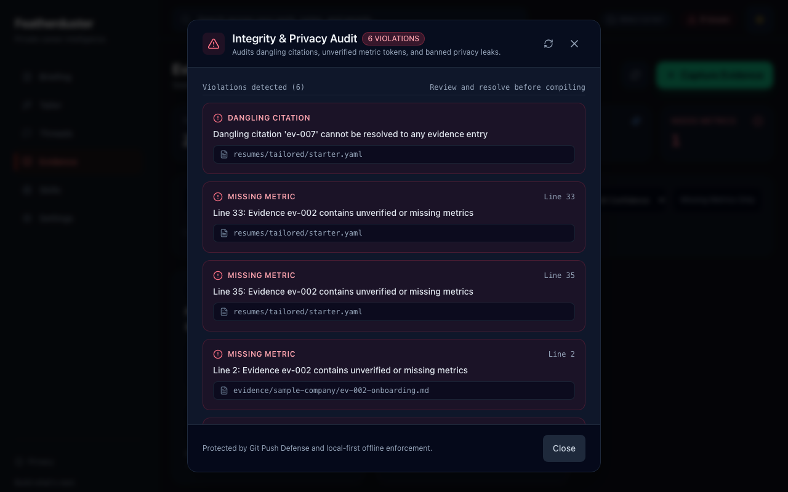
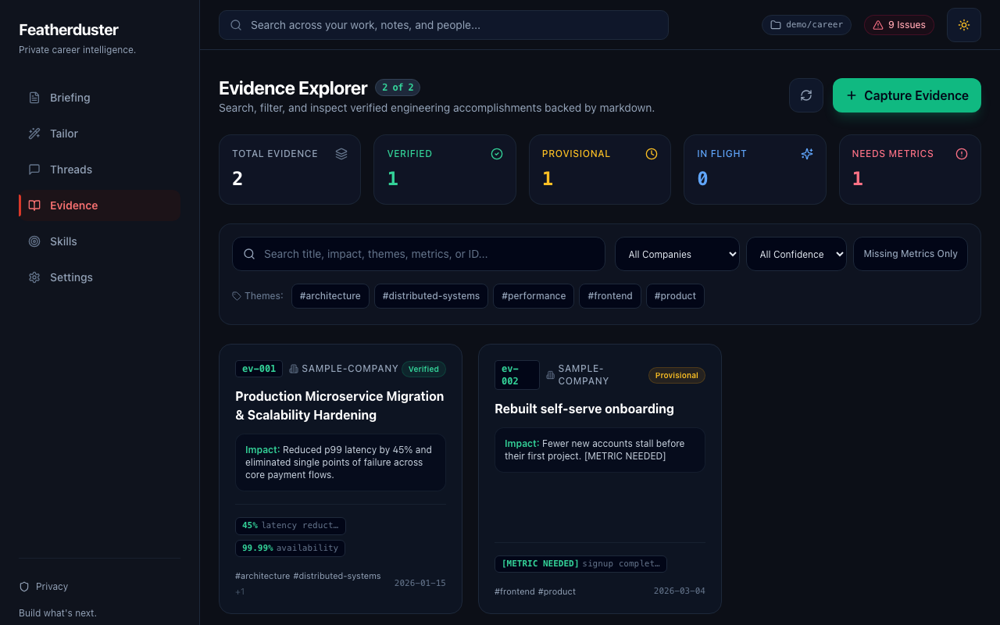

# Featherduster

A local tool for linking résumé bullets to dated evidence entries. `featherduster check`
flags dangling citations, missing-metric placeholders, and certain evidence-status problems.



## Why

Résumé bullets drift. Across a few rewrites a number gets rounded up, a team result becomes a
personal one, and a year later nobody, including me, can say where a claim came from. I wanted
each line on my résumé to point at a note I wrote when the work happened, and I wanted a tool to
tell me when a line stopped pointing at anything.

## How it works

**Evidence** is a folder of markdown files, one per piece of work, with YAML frontmatter:

For example, `evidence/acme/ev-002-onboarding.md`:

```markdown
---
id: ev-002
date: '2026-03-04'
company: acme
title: Rebuilt self-serve onboarding
summary: Reworked the flow from signup to the first project.
impact: Fewer new accounts stall before their first project. [METRIC NEEDED]
themes: [onboarding]
confidence: provisional        # verified | provisional | retracted
in_flight: true
metrics:
  - name: signup completion
    value: '[METRIC NEEDED]'
    status: missing
---
Context, what I did, and what changed, in plain prose.
```

**Résumés** are YAML specs in `resumes/tailored/`. Each bullet lists the evidence it relies on:

```yaml
- text: Rebuilt self-serve onboarding, lifting signup completion by 30% (ev-002).
  citations: [ev-002]
```

**`featherduster check`** reads both and exits non-zero when it finds:

- a citation that doesn't resolve to an evidence entry
- a citation to evidence with recognized unverified-metric flags or missing-metric placeholders
- an unresolved `[METRIC NEEDED]` token
- a citation to retracted evidence (provisional evidence is a warning unless `--strict` is used)
- a banned keyword from `privacy-rules.yaml` (codenames, client names)
- stock filler phrases in evidence and résumé markdown files ("spearheaded cross-functional synergies")

The example above triggers missing-metric errors and provisional-evidence warnings. Here is
an excerpt from a larger sample workspace that also contains a dangling citation:

```
$ featherduster check
✖ [FAIL] Integrity check failed with 6 violation(s) across 7 files:

   DANGLING_CITATION  resumes/tailored/starter.yaml
    Dangling citation 'ev-007' cannot be resolved to any evidence entry

   MISSING_METRIC  resumes/tailored/starter.yaml:33
    Line 33: Evidence ev-002 contains unverified or missing metrics
   …
```

Run `check --strict` in a pre-push hook or CI to fail on these errors and provisional evidence.

**`featherduster build`** compiles a résumé spec to Markdown, print-ready HTML, Typst, or LaTeX,
stripping citation tags and applying `privacy-rules.yaml` (configured ticket-ID patterns removed,
internal names swapped for public ones). It can also build a brag doc from evidence grouped by
a leveling rubric; that format applies privacy rules to narrative text but retains evidence IDs.
The interview prep brief (`--format brief`) is a private, unredacted document that retains
internal references and evidence notes.

**The web UI** (`featherduster [workspace]`, served on `127.0.0.1:4173`) browses and filters the
evidence, groups it into threads by theme, maps it against a leveling rubric, and shows the same
audit as `check`.



### Optional: tailoring to a job posting

Paste a posting and a model works through four steps you review one at a time: break down the
posting, match it to your evidence, propose cited edits, and write an interview prep brief. Each
proposed edit is validated by dedicated proposal checks before you can accept it.

The Claude Code CLI, Codex CLI, and Anthropic API are cloud runners: they receive text after
`privacy-rules.yaml` redaction and consent, with a preview of the payload. Consent is stored per
runner. Ollama receives raw text; use an Ollama server on your own machine to keep inference
local. The evidence browser, integrity checks, and compilers work offline.

## Getting started

Featherduster isn't published to npm yet. Run it from a clone (Node 20+):

```bash
git clone https://github.com/andrewwylde/featherduster.git
cd featherduster
npm install
npm run build

# create a workspace (kept outside this repo; it holds your private notes)
git init ../career
node packages/cli/dist/bin.js init ../career --block-push

node packages/cli/dist/bin.js check ../career      # audit
node packages/cli/dist/bin.js ../career            # web UI on http://127.0.0.1:4173
node packages/cli/dist/bin.js build -w ../career --format typst -o resumes/exports/resume.typ
```

`init` creates a sample evidence entry, a starter résumé spec, a privacy rules file, an
engineering IC rubric, and an `AGENT.md` with the rules a coding agent should follow when
editing the workspace. In an existing Git repository, `--block-push` creates and activates a
pre-push hook that blocks ordinary pushes of these private notes. Without `git init`, the hook
file is created but not activated. Git hooks are local safeguards and can be bypassed.

## Limits

- `check` validates citations it finds; it doesn't require every bullet to have one or compare
  a bullet's numbers with evidence values. Metric checks recognize specific flags and
  placeholders, rather than requiring every metric's status to be `verified`. A passing check
  doesn't establish that a claim is supported or true. Review numbers and authorship yourself.
- `build` doesn't run `check`. Run `check` first, or wire it into a hook.
- An evidence file whose frontmatter fails validation is skipped. If cited, it shows up as a
  dangling citation rather than a schema error; uncited invalid entries can go unnoticed.
- The filler-phrase scan covers markdown files, not résumé YAML specs.
- The canvas's built-in "Starter Template" uses hard-coded sample data, not your workspace.

## Code

TypeScript monorepo with npm workspaces:

| Package | What it is |
|---|---|
| `packages/core` | Zod schemas, evidence store, integrity checks, redaction, and the compilers. No I/O. |
| `packages/cli` | The `featherduster` command and a [Hono](https://hono.dev/) server bound to `127.0.0.1`. |
| `packages/ui` | React + Vite + Tailwind front end, served by the CLI. |

```bash
npm test          # Vitest across all packages
npm run build     # core → ui → cli
```

Much of this code was written with AI coding agents working from task lists; `adws/`,
`.taskmaster/`, and the Python files in `scripts/` are that tooling. I review and own what lands.

## License

MIT
